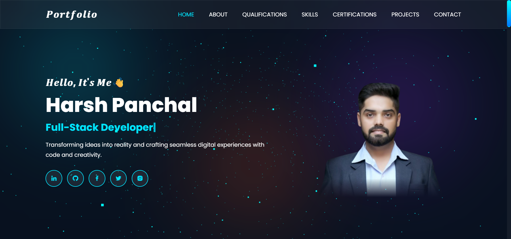

# 🌐 Personal Portfolio Website

A modern and responsive **Personal Portfolio Website** built using **HTML, CSS, and JavaScript**, featuring stunning **Glassmorphism UI**, animated backgrounds with **Three.js**, and dynamic typing effects powered by **Typed.js**.

Website is live at : https://developerharshpanchal.github.io/portfolio/ 

## ✨ Features

- 🏠 Home Section
- 👨‍💻 About Me
- 🎓 Qualifications
- 💡 Skills
- 📜 Certifications
- 🚀 Projects Showcase
- 📬 Contact Section
- 🌐 Social Media Links
- ⌨️ Typing Animation using Typed.js
- 🎨 Modern Glassmorphism Design
- 🌌 Interactive Three.js Background
- 📱 Fully Responsive Design
- ⚡ Smooth Scrolling and Animations

---

## 🛠️ Built With

- **HTML5**
- **CSS3**
- **JavaScript (ES6)**
- **Typed.js**
- **Three.js**

---

## 📂 Sections Included

### 🏠 Home
Introduction with animated typing effects and social media links.

### 👨‍💻 About
Brief overview about me and my journey as a developer.

### 🎓 Qualifications
Educational background and achievements.

### 💡 Skills
Technical skills and technologies I work with.

### 📜 Certifications
Certificates and accomplishments.

### 🚀 Projects
Collection of my featured projects with descriptions.

### 📬 Contact
Ways to connect with me.

### 🌐 Social Media
Links to my professional profiles and platforms.

---

## 🎨 Design Highlights

- Glassmorphism UI
- Blur Effects
- Floating Animations
- Smooth Transitions
- Interactive Background using Three.js
- Clean and Minimal Layout

---

## 📸 Preview



---

## 🚀 Getting Started

### Clone the Repository

```bash
git clone https://github.com/your-username/portfolio.git
```

### Navigate to Project Folder

```bash
cd portfolio
```

### Open in Browser

Simply open:

```bash
index.html
```

or use **Live Server** in VS Code.

---

## 📁 Project Structure

```
portfolio/
│
├── index.html
├── style.css
├── script.js
├── images/
├── assets/
└── README.md
```

---

## 🌟 Technologies Used

| Frontend | Libraries |
|-----------|-----------|
| HTML5 | Typed.js |
| CSS3 | Three.js |
| JavaScript | Boxicons |

---

## 📬 Connect With Me

- LinkedIn
- GitHub
- Instagram
- Email

---

## ⭐ Show Your Support

If you like this project, please consider giving it a **star ⭐** on GitHub.

---

### Made with ❤️ by Harsh Panchal
